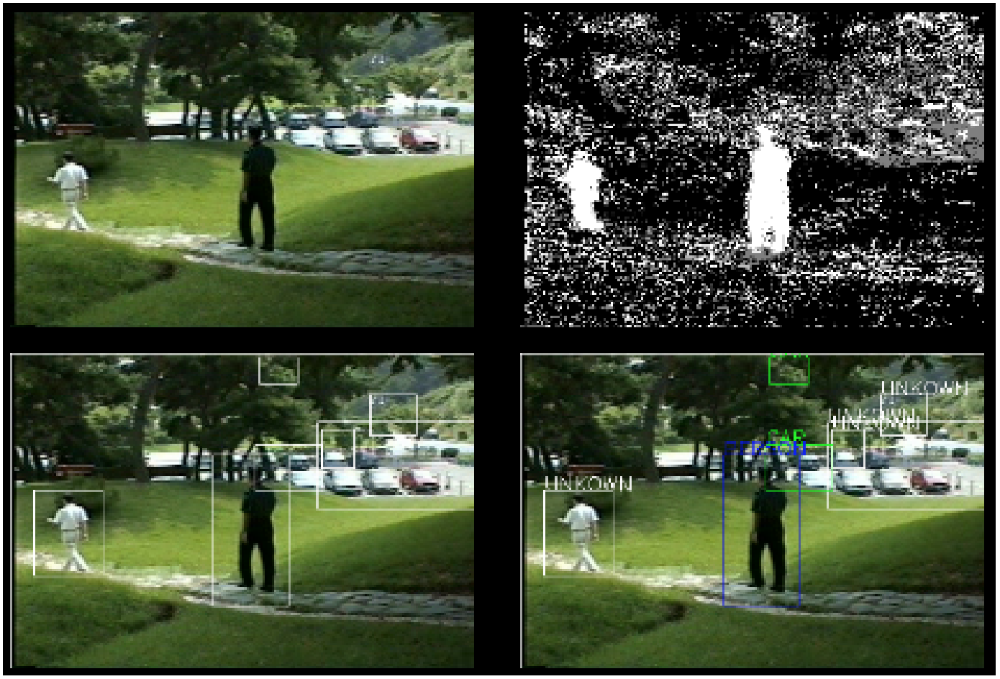
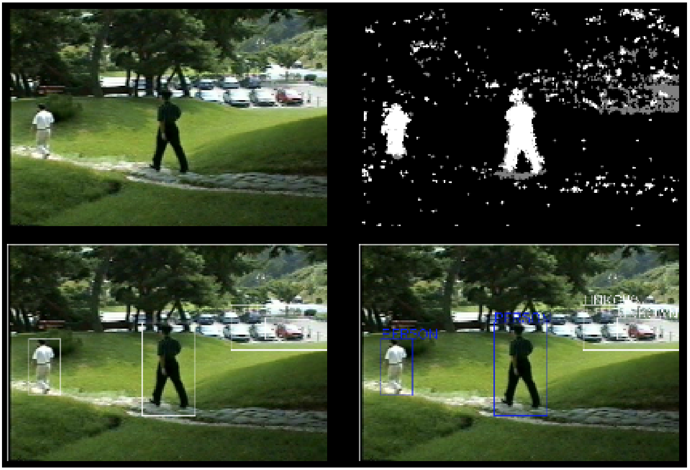
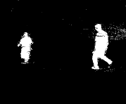
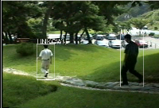
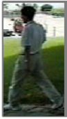
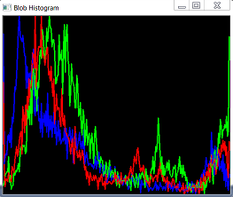
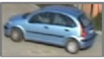
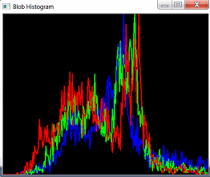

# Object Detection and Classification using OpenCV and C++

## Introduction
Object detection and classification for video sequences using Computer Vision methods with OpenCV, and C++ [3].  

Implements:  
1. Blob extraction using  Sequential Grass-Fire algorithm [1], filtering the blobs with a size below a certain threshold to eliminate noise.  
2. Blob classification using Aspect Ratio feature and simple statistical classifier.  
3. Implements the extraction of stationary foreground pixels based on foreground history.  
4. Custom implementation of Grass-Fire algorithm without the use of OpenCV’s built-in Connected Component Analysis functionalities [2].  
5. Alternative method to improve blob classification by using statistical properties of color channels. The implementation is tested on two datasets.  

## Data
We use a video sequence form a static surveillance CCTV camera, that includes people crossing a path in the midle of an outdoors green area, with a car parking area in the foreground that includes moving cars. An alternative video is also used for the last implementation (5).

## Methods

To begin with, Foreground Segmentation has been performed using OpenCV MOG2 subtraction method [4], turning to be very noisy for most of the scenarios. Before any blob analysis, we have applied a set of morphological operations to correct the noisy foreground mask, reducing the amount of false blobs detected in following steps. Blob extraction using Connected Component Analysis has been implemented using three different methods, the first being the suggested method, OpenCV 'floodFill', which presented performance issues. This led us to the second method, OpenCV 'connectedComponentsWithStats', that solves the problem of performance. The last method implemented corresponds to our own version of Grass-Fire algorithm.  

For blob Classification, the Aspect Ratio of the blobs has been used as the feature to be compared with the Person-Car-Object model pre-defined, using Euclidean Distance.  

An attempt to improve this classifier has been performed, please refer to the section 'Blob Classification' below for more details.  

### Foreground Subtraction and Morphological Operations
Using OpenCV MOG2 as a subtraction method we obtain a noisy background mask as we can see in Fig. 1. 

  

Fig. 1. OpenCV MOG2 noisy background.  

To correct for noise, we apply a set of morphological operations to the noisy background mask, see Fig. 2.

  

Fig. 2. Applying morphological operator 'Opening'.  

With this noise removal we facilitate further steps.  

  

Fig. 3. Frame. 

  

Fig. 4. Foreground mask. 

  

Fig. 5. Blob extraction. 

### Blob Extraction using CCA  

Blob extraction using Connected Component Analysis (CCA) has been implemented using three different methods, which are based on *Sequential Grass-Fire* algorithm:  

*Sequential Grass-Fire algorithm* is a method used to extract blobs from a background mask that uses the analogy of a fire propagating to connected pixels (representing a blob). The algorithm performs as many fires as blobs are in the image, according to the structural element used for deciding which pixels are connected and which are not. At the end, a blob is assigned to every different fire performed, resulting in the desired blob segmentation.  

**Implementation:** 
The first implementation corresponds to the suggested method, suing OpenCV **floodFill**. The method provides blob extraction but presents problems with performance in the present scenario.

So CCA is also tested using OpenCV *connectedComponentsWithStatsThese*. This second method solves the problem of performance while also provides basic statistics about the blobs detected.  

The last method implemented corresponds to our own version of Grass-Fire algorithm, using its non-recursive version. The algorithm works, but presents similar performance issues as the *FloodFill* version, slowing down very fast when big blobs enter the scene.

### Blob (object) classificaion  
For the classification part, a simple Gaussian statistical classifier using the feature *aspect ratio* is implemented.  

The reference model for classification is empirically obtained, and Mean and Variance for each of the classes (PERSON, CAR and OBJECT) are hardcoded in the C++ Project.  

As a method to measure the feature distance to the model classes' features, we use Euclidean Distance:  

$ED(\overrightarrow{f},\overrightarrow{f_{m}}) = \sum_{i=1}^{n}\sqrt{(f_{i}-\mu_{mi})^2}$  

We are using a single feature, so no normalization has been performed. For every blob we compute the Euclidean distance of its Aspect Ratio to the Mean of each class, and only consider those values that are inside the variance range (Mean $\pm$ Variance) as candidate classes for the blob. Finally we pick the class with the smallest Euclidean distance to the blob. If any class is selected we set the blob with the class UNKNOWN.  

With this method, the miss-classification of people and cars for UNKNOWN class has turned to be high, therefore we implemented two approaches to try to improve it. The **first approach** consists on a simplification of the method based on Aspect Ratio already mentioned. By suppressing the restriction of having to meet the variance, and giving preference to the classes PERSON and CAR, we can increase the amount of times a PERSON or a CAR are correctly classified with much better accuracy, but this goes in detriment of the third class, OBJECT, that is almost never picked.  

The **second approach** considers the color channels of the blob. We use the coordinates of the extracted blob to cut the object from the frame. Then, in a first attempt, we calculated Mean and Variance of the three RGB channels to try to achive distinctiveness, but this approach turned to be simplistic. So we decided to implement a more robust strategy based on the Histograms of these channels. For it, we calculated the histograms of RGB channels, and H-S channels of HSV color space, and plotted them to see how different were these histograms for different objects in several scenes.

  

Fig. 3. Person blob from first video sequence.  

  

Fig. 4. Person RGB Histogram.  

  

Fig. 3. Car blob from second cideo sequence.  

  

Fig. 4. Car RGB Histogram.  

It is relevant to point out that channels H and S of HSV are known to have better photoelectric invariability, so histograms of H and S color channels are better candidates for the construction of a more robust Model against changes in imaging conditions.  

The histograms have been normalized, so Blobs with different sizes can be compared against the histograms of a model.

Since we lack the amount of data to generate a model based on these features, we just include the algorithm for classification in the C++ project, but we can not report a formal evaluation of the approach.

### Stationary Foreground Detection based on Foreground History
Different methods can be used to detect stationary foregrounds. One approach is the adaptive background subtraction algorithm using different learning rates. Depending on the learning rate, we do not get a good performance as the static objects were detected as background before they become static.  

We have improved this approach by incorporating foreground history information into the background subtraction method in the following manner.  

We measure the foreground temporal variation to get a Foreground History Image FHIt(x), by adding the foreground history with a weighted foreground mask. The contribution of the foreground ($F Gt(x) = 1$) and background ($F Gt(x) = 0$) detection are managed by incorporating different costs.  

$FHIt(x) = FHIt−1(x) + I-COST * FGt(x)$  
$FHIt(x) = FHIt−1(x) - D-COST* \sim FGt(x)$  

We increment FHIt values when they belong to the foreground and decrement $FHIt$ at a higher rate than the positive one (instead of resetting it to 0) when they belong to the background. Because, if we reset FHIt values to 0 when they are background we may lose correct stationary detection due to foreground detection error. The learning rate value has a big effect on the performance of our code. Therefore, we have used a small number for the learning rate which decreases the performance of the foreground mask. We later improve this using the morphological method.  

After obtaining foreground history, we normalize it to the range [0, 1] by the video frame rate and remove negative values in case there is one. (fps) and the stationary detection time (secstationary):  

$FHIt(x) = min{1, FHIt(x)/(fps * secstationary)}$  

Finally, the foreground history is compared with some threshold value. Then we set a stationary foreground mask to 1 if it is greater than the threshold $FHIt(x) ≥ STAT_TH$. and set it to 0 if it is less than the threshold. $FHIt(x) < STAT_TH$.  

## Implementation and Dependencies
The development environment used was Visual Studio 2017 with OpenCV 3.4.4 and the programming language C++, running on a Windows machine. And a second development environment using an Ubuntu Virtual Machine, Eclipse and OpenCV 3.4.4. The C++ project files are include under './src/' folder.

## Conclusion
We can conclude that blob analysis is highly dependent on the quality of the background mask subtracted, making important to dedicate special attention to the background segmentation method utilized. In our case, the use of morphological operations to reduce noise has turned to be effective. For blob extraction, a simple Sequential Grass-Fire algorithm implementation can be computationally costly, so the optimization of this part is also important, specially if a real-time application is being considered. In addition, we haven't noticed big differences by changing the structuring element (4,8) used by Grass-Fire to decide connectivity. For the classification part, we have seen that a single feature produces decent results, although we experienced some problems with the class Object, since it can present statistical properties that overlap with the aspect ratio of the class Car in some cases. It would be interesting to explore more features to refine the classification, like the use of Histograms from H and V channels of HSV color space proposed.  

## Cite this work
    J. Rico (2021) Object Detection and Classification for CCTV cameras using OpenCV and C++.
    [Source code](https://github.com/jvirico/object_detection_classification)

## References
[1] - Moeslund T.B. (2012) BLOB Analysis. In: Introduction to Video and Image Processing. Undergraduate Topics in Computer Science. Springer, London. https://doi.org/10.1007/978-1-4471-2503-7_7  
[2] - [Connected-Component labeling.](https://en.wikipedia.org/wiki/Connected-component_labeling)  
[3] - [OpenCV Tutorial C++.](https://www.opencv-srf.com/p/introduction.html)  
[4] - [OpenCV MOG2, Background Substraction.](https://docs.opencv.org/4.5.2/de/df4/tutorial_js_bg_subtraction.html)