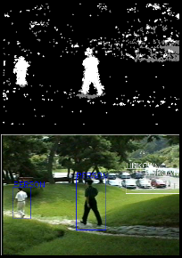

# Object Detection and Classification using OpenCV and C++

## Introduction
Object detection and classification using Computer Vision, OpenCV, and C++.  

Implements: 
    (1) blob extraction using  SequentialGrass-Fire algorithm, removing the blobs with a size below a certain threshold to eliminate noise.  
    (2) Blob classification using Aspect Ratio feature and simple statistical classifier.  
    (3) Implementation of extraction of stationary foreground pixels based on foreground history.  
    (4) Custom implementation of Grass-Fire algorithm without using OpenCV’s in-built Connected Component Analysis functionalities.  
    (5) Attempt to improve blob classification by using statistical properties of color channels. The implementation is tested on two datasets.  

## Methods

To begin with, Foreground Segmentation has been performed using OpenCV MOG2 subtraction method, turning to be very noisy for most of the scenarios. Before any blob analysis, we have applied a set of morphological operations to correct the noisy foreground mask, reducing the amount of false blobs detected in following steps. Blob extraction using Connected Component Analysis has been implemented using three different methods, the first being the suggested method, OpenCV 'floodFill', which presented performance issues. This led us to the second method, OpenCV 'connectedComponentsWithStats', that solves the problem of performance. The last method implemented corresponds to our own version of Grass-Fire algorithm.  

For blob Classification, the Aspect Ratio of the blobs has been used as the feature to be compared with the Person-Car-Object model pre-defined, using Euclidean Distance.  

An attempt to improve this classifier has been performed, please refer to the section 'Blob Classification' below for more details.  

### Foreground Subtraction and Morphological Operations
Using OpenCV MOG2 as a subtraction method we obtain a noisy background mask as we can see in Fig. 1. 

  

Fig. 1. OpenCV MOG2 noisy background.  

To correct for noise, we apply a set of morphological operations to the noisy background mask, see Fig. 2.

  

Fig. 2. Applying morphological operator 'Opening'.  

With this noise removal we facilitate further steps.  

## Blob Extraction using CCA  

Blob extraction using Connected Component Analysis (CCA) has been implemented using three different methods, which are based on *Sequential Grass-Fire* algorithm:  

*Sequential Grass-Fire algorithm* is a method used to extract blobs from a background mask that uses the analogy of a fire propagating to connected pixels (representing a blob). The algorithm performs as many fires as blobs are in the image, according to the structural element used for deciding which pixels are connected and which are not. At the end, a blob is assigned to every different fire performed, resulting in the desired blob segmentation.  

**Implementation:** 
The first implementation corresponds to the suggested method, suing OpenCV **floodFill**. The method provides blob extraction but presents problems with performance in the present scenario.

So CCA is also tested using OpenCV *connectedComponentsWithStatsThese*. This second method solves the problem of performance while also provides basic statistics about the blobs detected.  

The last method implemented corresponds to our own version of Grass-Fire algorithm, using its non-recursive version. The algorithm works, but presents similar performance issues as the *FloodFill* version, slowing down very fast when big blobs enter the scene.

## Blob classificaion  
For the classification part, a simple Gaussian statistical classifier using only *aspect ratio* feature is implemented.  

The model for classification is empirically obtained, and Mean and Variance for each of the classes (PERSON, CAR and OBJECT) are hardcoded in the C++ Project.
As a method to measure the feature distance to the model classes' features, we use Euclidean Distance:  

$ED(\overrightarrow{f},\overrightarrow{f_{m}}) = \sum_{i=1}^{n}\sqrt{(f_{i}-\mu_{mi})^2}$  

We are using a single feature, so no normalization has been performed. For every blob we compute the Euclidean distance of its Aspect Ratio to the Mean of each class, and only consider those values that are inside the variance range (Mean $\pm$ Variance) as candidate classes for the blob. Finally we pick the class with the smallest Euclidean distance to the blob. If any class is selected we set the blob with the class UNKNOWN.  

With this method, the miss-classification of people and cars for UNKNOWN class has turned to be high, therefore we implemented two approaches to try to improve it. The **first approach** consists on a simplification of the method based on Aspect Ratio already mentioned. By suppressing the restriction of having to meet the variance, and giving preference to the classes PERSON and CAR, we can increase the amount of times a PERSON or a CAR are correctly classified with much better accuracy, but this goes in detriment of the third class, OBJECT, that is almost never picked.  

The **second approach** considers the color channels of the blob. We use the coordinates of the extracted blob to cut the object from the frame. Then, in a first attempt, we calculated Mean and Variance of the three RGB channels to try to achive distinctiveness, but this approach turned to be simplistic. So we decided to implement a more robust strategy based on the Histograms of these channels. For it, we calculated the histograms of RGB channels, and H-S channels of HSV color space, and plotted them to see how different were these histograms for different objects in several scenes.

  

Fig. 3. Person blob.  

  

Fig. 2. Classification Examples.  

## Cite this work
    J. Rico (2021) Object Detection and Classification using OpenCV and C++.
    [Source code](https://github.com/jvirico/object_detection_classification)

## References
[1] -   